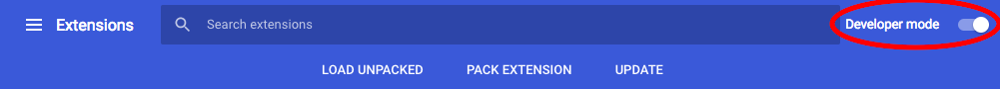
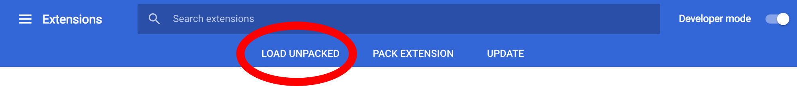
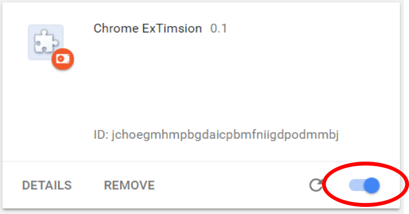
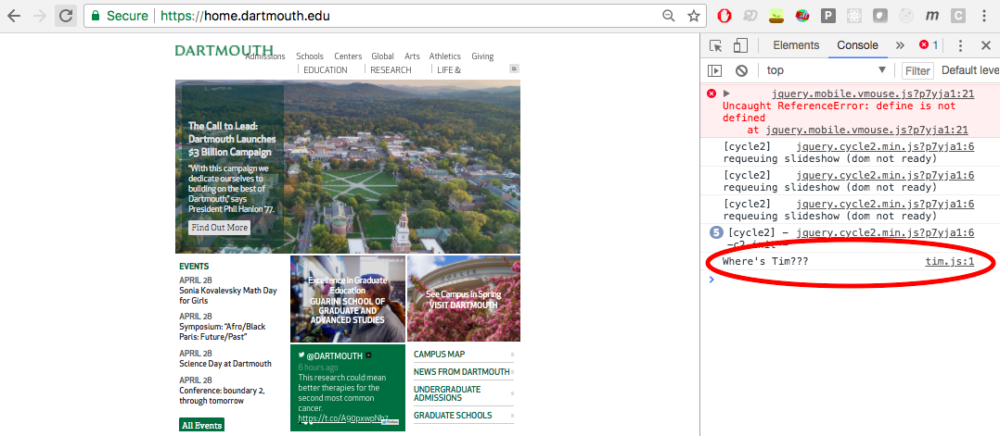
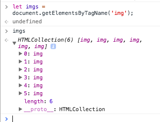
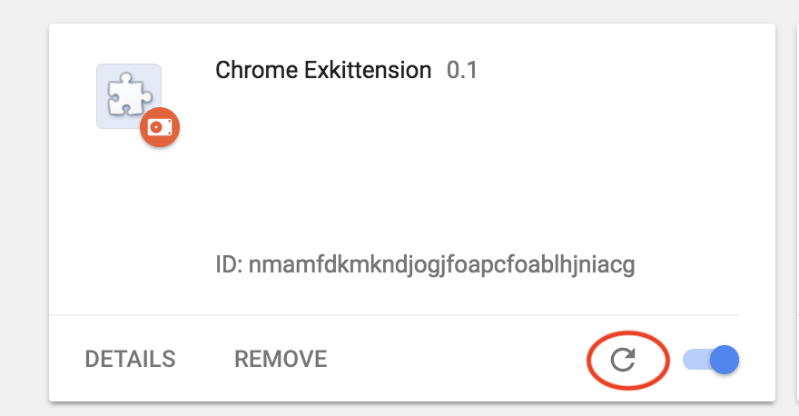
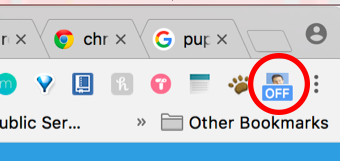

# CS52 Workshops: Chrome Extensions

We don't need a new domain name to change the way we interact with the web! Today we'll be customizing our browser with a Chrome extension. Chrome extensions can serve as many functions as your imagination can create, but today we'll be using simple code to tweak the way you experience webpages of any degree of complexity.

## Overview

Do you ever miss seeing Tim between classes?

We do!

Chrome extensions allow us to personalize our web-browser, it's time to Timify the way we experience the internet. With just a little bit of code, the sometimes-scary internet can be a much friendlier place. Just clicking our custom chrome extension button in the top right of our browser replaces all a website's images with images of Tim!


In order to make google chrome sufficiently Tim-saturated, we'll do the following:
* [ ] Replace all the image elements with images of Tim
* [ ] Replace text of choice on webpages to 'Tim!'
* [ ] Create a pretty button to toggle your extension on and off

All of this will be done with just a javascript file, a manifest.json, and lots of images!

## Setup

* Fork this repo, it contains some default photos for you to use.

## Step by Step

### Create Manifest
* Create a ```manifest.json``` file in your directory. ```manifest.json``` is kind of like the ```package.json``` that we've been working with.

```json
  {
    "manifest_version": 2,
    "name": "Chrome Extimsion",
    "version": "0.1",
    "content_scripts": [
        {
        "matches": [
          "<all_urls>"
        ],
        "js": ["tim.js"]
      }
    ],
    "icons": { "48": "img/tim.png" }
  }
```

Let's take a step back and examine what's going on here. Chrome extensions can have background scripts and/or content scripts. Background scripts run in the background and can be always running or can be idle and only run when triggered. Content scripts run in the context of the web page that you are currently on. By setting `matches` to `<all_urls>`, we are saying that we want our extension to run on all web pages. The `js` part of the manifest lists all of the javascript files that we will be using as part of the content script. The `icons` are setting the image icon of the extension in the developer page.

### Add some Javascript!
* As hinted at in the manifest, we will now create a new file ```tim.js```
* Add a ```console.log``` statement in this file, we will use this later to ensure it's working.
```Javascript
  console.log('Where\'s Tim???');
```

### Link to Chrome Extensions
Now it's time to upload our extension to chrome!

* Go to [chrome://extensions](chrome://extensions/) and make sure *Developer mode* in the upper right hand corner is toggled on.


* Click on *Load Unpacked* and select the directory that contains your chrome extension.


* Make sure you turn on chrome extension. If there is an error in the code, it will give you an error message and not let you turn it on.  


:white_check_mark: Check-in! Navigate to another [website](https://home.dartmouth.edu/) (load a new tab) and inspect the page. In the console, your previous ```console.log``` statement should now appear!


### Find image elements to replace
Let's take a moment to understand what we're looking for!
* In the inspector console of the same page you just opened, type
```javascript
  let imgs = document.getElementsByTagName('img');
```
* Then call ```imgs``` and open the HTMLCollection to view all the images on the page.


Expand any image number to view the attributes of the image. Scroll down until you see ```src``` (attributes should be alphabetical). We will be using the ```img``` tag to find and replace the source of each images with your own pictures!

Now you get to select your images! We have provided some default images of Tim in the img folder, but feel free to replace them with your own! You can fill your pages with unicorns or puppies or delicious food - whatever your heart desires (but why wouldn't you want to use these gems?)!

Whenever we have files inside the extension that we want to use (in this case, our pictures), we have to declare them inside ```manifest.json```.

* Add the following in ```manifest.json``` before `content_scripts` :

```json
"web_accessible_resources": [
  "img/*.jpg",
  "img/*.jpeg"
],
```

This tells the manifest that we want the browser to be able to access these all of the jpeg images in the `img` folder. **If you are using different image formats (like pngs), make sure to include them in this part.**

We've played around in the inspector and understand what we are looking for. Let's code it up in our extension project.

We want to gather all of the images on the page into a variable, just like we did in the inspector.  
* Add the following to `tim.js`:

```javascript
  let imgs = document.getElementsByTagName('img');
```

* We need an array containing the filenames of all of our images. Let's create that! Somewhere before you create the `imgs` variable, create a variable that references an array containing your image filenames:

```Javascript
let filenames = [
  'img/tim1.jpg',
  'img/tim2.jpg',
  'img/tim3.jpg',
  'img/tim4.jpg',
  'img/tim5.jpg',
]
```

Now we have all the images of the website in a variable and an array holding all our image filenames. What do we need to do now?

* If you said replace the current images with our own images, that's correct! We need a for-loop to loop through all of the current images. Let's just log the `src` of each image for now:

```Javascript
for (imgElement of imgs) {
  console.log(imgElement.src);
}
```

* Now navigate back to [chrome://extensions](chrome://extensions) and hit refresh on the "Chrome ExTimsion" extension:
  
Every time you make a change to your code, you need to click this refresh button.

* Navigate to any website (if you go to one that you already have opened make sure to refresh the page so it reloads the extension), and open up the inspector. You should see a list of the image sources!

But don't we want to replace the current images? Yep, we do! Instead of logging the image sources, let's set the source to a random filename from our array of filenames.  
* Replace `console.log(imgElement.src);` with this:

```Javascript
  let r = Math.floor(Math.random() * filenames.length);
  let file = filenames[r];
  let url = chrome.runtime.getURL(file);
  imgElement.src = url;
  console.log(url);
```

What we are doing here is generating a random index into our array (the floor function makes sure that it is an integer), indexing into the array and grabbing that corresponding url, and setting the `src` of the image to that url. An interesting thing here is that we have to use `chrome.runtime.getURL`. We cannot just set `imgElement.src` equal to `file` because these files live inside our chrome extension and image sources need to be actual paths. `chrome.runtime.getURL` gives us back a valid URL of a file that is part of our chrome extension.

* Reload the chrome extension and navigate to a webpage. All the images there should be replaced by images of Tims (or whatever images you used)!

### Replacing text
Let's do some more replacement and just replace some text.

* Add this to `tim.js`:

```javascript
let text = document.querySelectorAll('p,li,h1,h2,h3,h4,span,div,b');
for (element of text) {
  element.innerHTML = element.innerHTML.replace(/\b([A-Z]\w*)\b/g,'Tim!');
}
```

We are grabbing all of the HTML structures that display text and replacing all capitalized words using a regex expression in a similar manner to how we replaced images.

### Adding A button

* We want to be able to turn this extension on and off. Let's go into `manifest.json` and add the following code after `web_accessible_resources` and before `content_scripts`:

```json
"permissions": [
  "tabs",
  "storage",
  "notifications",
  "http://*/",
  "https://*/"
],
```

This tells the browser that your extension will be using various parts of the Google Chrome API, like storage and tabs.

* We will also be using a background script, so add the following to `manifest.json` after `content_scripts`:

``` json
"background": {
  "scripts": ["background.js"]
},
```

* We also want a default icon for our extension, so add the following after `background`:

```json
"browser_action": {
  "default_icon": "img/tim.png"
},
```

Cool, we're done with the manifest! Let's move on to the background script. 
* Create a `background.js` and add the following to it:

```javascript
chrome.browserAction.setBadgeText({ text: 'OFF' });
```

Here, we are making it so that our icon shows when the extension is on and off.  
* Reload the extension in [chrome://extensions](chrome://extensions/), and the icon should show up with "OFF" over it.  
  

We will be using a boolean and using the value of the boolean as the switch between the on and off states.  
* Add the following to `background.js` after what you already have:

```javascript
var enable=false;
chrome.storage.sync.set({"enable": enable});
```

We are using chrome's storage to keep track of the state of this boolean. We want to change the state of this boolean when we click on the icon. 
* Let's add an onClick Listener to the icon, passing into it a callback that gets executed:  

```Javascript
chrome.browserAction.onClicked.addListener(function (tab) {
  enable = !enable;

  if (enable) {
    chrome.browserAction.setBadgeText({ text: 'ON' });
    chrome.tabs.executeScript(null, { file: 'tim.js' });
  } else {
    chrome.browserAction.setBadgeText({ text: 'OFF' });
    chrome.tabs.executeScript(tab.id, {code: 'window.location.reload();'});
  }

  chrome.storage.sync.set({"enable": enable}, function() {
    console.log('Value is set to ' + enable);
  });
});
```

We are passing a callback here that switches the state of our boolean variable. Based on the value of the variable, we set the badge text to on or off, and then either execute our `tim.js` content script if it is on or reload the window if the extension is off. We then finally set the storage value to our newly changed boolean value.

We need to also modify our `tim.js` content script so that it only runs when the boolean value in storage is set to true. Let's hop over to `tim.js` and add some modifications.

* Above your current `tim.js` code, add the following code:

```Javascript
chrome.storage.sync.get("enable", function(result) {
  console.log('Value currently is ' + result.enable)
  if (result.enable) {
```

* And adding closing off syntax, put this after your code:
```
  }
});
```
We are getting the boolean value from storage here and passing in a callback, telling the script to execute only when the boolean is true.

* Reload your chrome extension in [chrome://extensions](chrome://extensions/). Navigate to any webpage and click the icon, turning it on and off. We can now use this extension only when needed!

## Summary / What you Learned

* [X] What goes in a chrome extension manifest
* [X] Write some javascript for your chrome extensions
* [X] Some quick and easy ways to bend complex webpages to your will
* [X] How to add a pretty chrome extension button in your browser

## Resources

* Initial idea and starting code found at https://www.youtube.com/watch?v=8zMMOdI5SOk
* A little starting example code: https://github.com/CodingTrain/website/tree/master/CodingChallenges/CC_82_Image_Chrome_Extension_The_Ex-Kitten-sion
